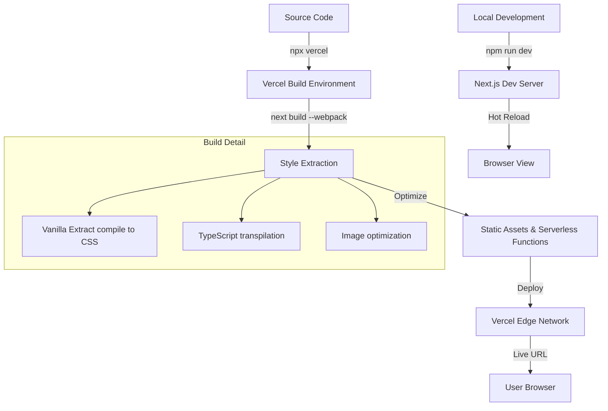

# Xmas Vacation Site: Technical Documentation

## Technical Stack

### Core Framework
- **Next.js 16 (App Router)**: React framework for high-performance web applications.
- **TypeScript**: Ensuring type safety and better developer experience.

### Styling & UI
- **Vanilla Extract CSS**: Zero-runtime, type-safe CSS-in-TypeScript. It pre-compiles styles into static CSS files during build.
- **Framer Motion**: Powering the smooth animations, snow effects, and interactive transitions.
- **Lucide React**: Clean, lightweight iconography for Christmas and New Year themes.

### Infrastructure & Deployment
- **Vercel**: Global edge network for hosting, featuring automated builds and instant previews.
- **Webpack Engine**: Used for the build process to maintain compatibility with CSS-in-JS pre-compilers.

---

## How It Works

### 1. The Styling Engine (Vanilla Extract)
Unlike traditional CSS-in-JS which runs in the user's browser, **Vanilla Extract** works at build time.
- We define variables (colors, spacing) in `vars.css.ts`.
- Components import these variables and define styles in `.css.ts` files.
- During `npm run build`, these are extracted into optimized `.css` files.

### 2. Interactive Effects
- **Snow Effect**: A fixed-position container generates randomized "snowflake" elements. CSS animations (`keyframes`) handle the falling motion to keep it high-performance.
- **Mouse Tracker**: A React `useEffect` listens for `mousemove` events, updating a state that moves a "frosty" glow element using hardware-accelerated CSS `transform`.

---

## Build & Deployment Flow

---

## Deployment Steps

1. **Prepare**: The `package.json` is configured with `"build": "next build --webpack"`.
2. **Trigger**: Run `npx vercel --prod`.
3. **Automated Build**:
   - Vercel installs dependencies (`npm install`).
   - Vercel runs the build script.
   - Vercel uploads the `.next` output folder.
4. **Finalize**: Vercel assigns a production URL (e.g., `https://advent-of-ai-day4.vercel.app`) and the site is live.
